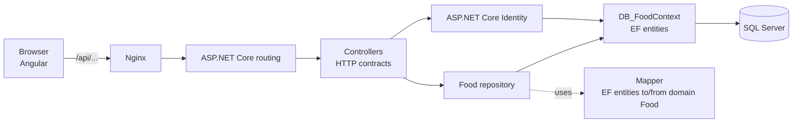
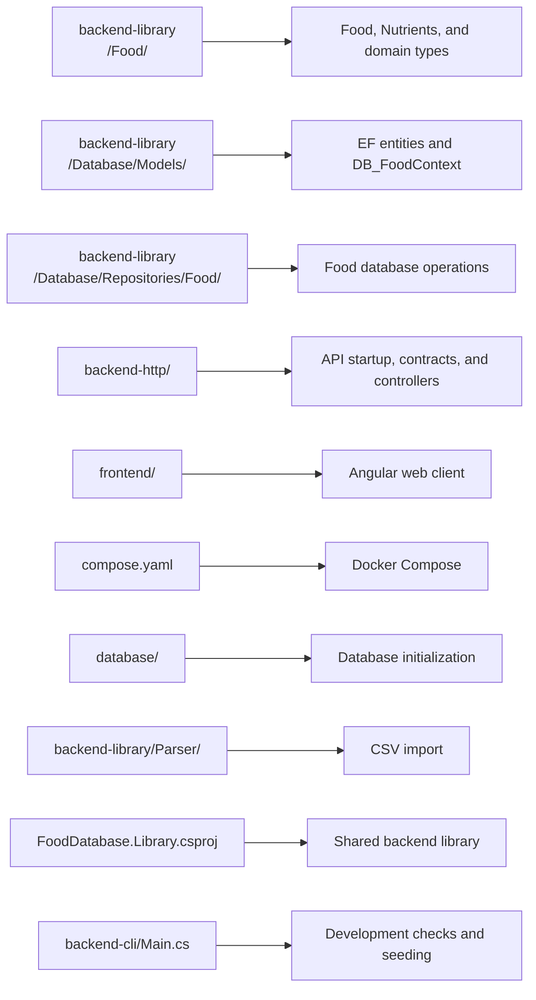
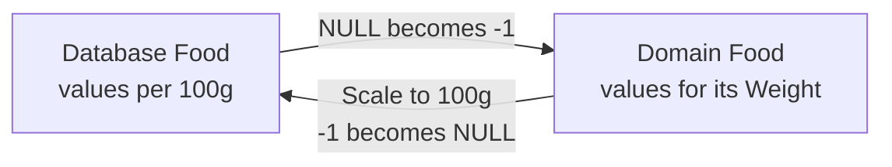
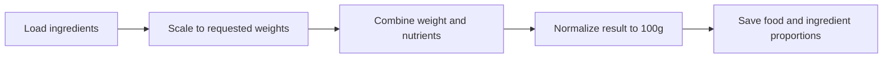
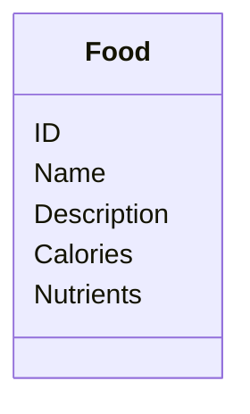
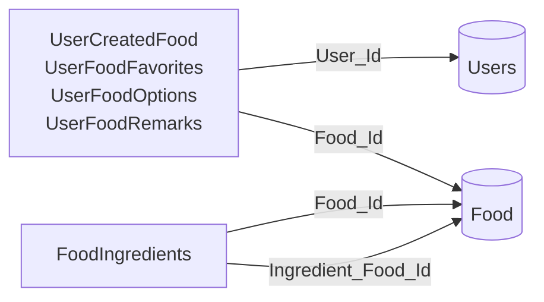
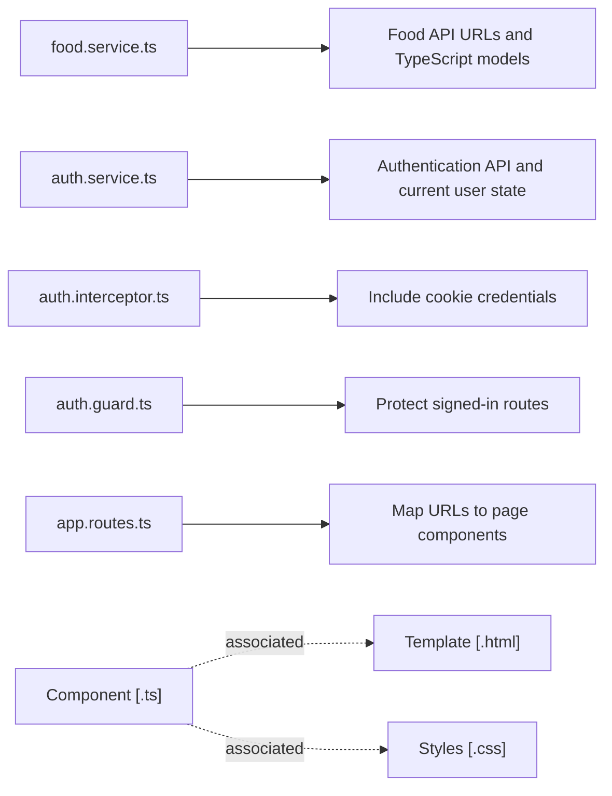

# Programmer docs

Food Database is a C# and Angular application deployed using Docker. It has
three running services in the background:
- **Angular**: browser inteface
- **ASP.NET Core**: the HTTP API
- **SQL Server**: stores application data

`backend-library` contains the food domain, Entity Framework Core entities,
repositories, and CSV import.\
`backend-cli` and `backend-http` are separate projects that reference it.
This keeps the web host out of the console exe,
while both programs use the same database.\
Angular calls the API.

The `.env` is required by Docker Compose.
Its values are development defaults.\
**Production deployment must set new values without committing `.env` file.**

Request path is:
1) The browser runs the `Angular` by `Nginx`.
2) `Angular` sends JSON requests to */api/...*. `Nginx` forwards them to the `ASP.NET Core API`.
3) `ASP.NET Core` handles **routing**, **auth**[entification, authorization],
and other configured stuff before callng `controller`.
4) `Controllers` **bind** HTTP contracts, obtain the current user
   when needed, and call the `Food repository` or `ASP.NET Core Identity`.
5) The `Food repository` queries or updates `DB_FoodContext`. `Mapper` converts
   between `EF entities` and domain `Food` objects, in both directions.
6) `EF Core` communicates with `SQL Server`. Responses return through the same
   HTTP path (well, reversed..).

The console program in `backend-cli/Main.cs` can call
repository and context directly -- for testing, maintenance checks (*--checkdb*), and seeding data
(*--seed*, should be done on empty database only).
Keep calculation and rules in the shared C# layers.

Code is meant as follows:\
`backend-library/Food/` for the `Food`, `Nutrients`, and related domain types\
`backend-library/Database/Models/` for EF entities and the context\
`backend-library/Database/Repositories/Food/` for food operations\
`backend-http/` for API startup, contracts, and controllers\
`frontend/` for the web client\
`compose.yaml` for Docker Compose\
`database/` for SQL Server initialisation\
`backend-library/Parser/` is the CSV importer\
The shared project file is `backend-library/FoodDatabase.Library.csproj`.
`backend-cli/Main.cs` is a development/console entry point, not runner for PAI.

Currently C# projects are .NET 10.\
The **backend** uses:\
`Entity Framework Core` for data access\
`ASP.NET Core Identity` for users and passwords\
`CsvHelper` for seed import\
`DotNetEnv` for console application's database settings\
**API** uses `ASP.NET Core` for dependency injection, CORS, cookie
auth, authorization, forwarded headers, and rate limiting\
The **frontend** is Angular 21\
Docker starts all of it, except console application.

The main data rule is that every `Food` database row stores its values
per 100g. A domain `Food.Weight` can represent another amount, such as a
250g package.
`Mapper` does the conversion:
SQL `NULL` represents an unknown nutrient, domain model uses `-1`.
Mapping *DB->Domain* converts `NULL` to `-1`, saving converts unknown values to `NULL`,
and normalizes known values to 100g based on foodw eight.
**New operations should use these conventions above.**

`FoodBase.Food` is the in-memory food representation.
It includes *ID, name, weight, nutrients, description, and ingredients*.
This and `Nutrients` support operations for scaling and combining foods.
A *composite food* is created by:
1) Loading ingredient foods
2) Scaling each from its 100g normalized amount to the requested amount
3) Adding their weights and nutrients in the domain model
4) Saving the result normalized again to 100g\
Its ingredient proportions are also saved relative to 100g.

If ingredient has an *ID <= 0* it also adds ingredient to database.
Only positive ingredient weights should be used.
Do not rely only on database self-reference protection.

`Database.Repositories.Foods.Repository` is a scoped service around `DB_FoodContext`.\
`Base.cs` provides context injection and `SaveChangesDBAsync`\
`Getters.cs` is for reads, generally using `AsNoTracking`\
`Updaters.cs` creates and changes data\
`Helpers.cs` handles common checks for data existence, etc.\
`Mapper.cs` converts between databse entities and the domain model.
> [!WARNING]
> Repository operations do EF records using key properties like `Id`,
and don't have to use EF object itself, because of usage of mapping.
But anyway try to have as little as possible operations for database.

Common reads are `GetFoodAsync`, `GetFoodsAsync`, `GetSystemFoodsAsync`.
There are also `GetUserCreatedFoodsAsync`, and `GetFavoritesWithOptionsAsync`.
Creation uses `AddFoodAsync` and `CreateCompositeFoodAsync`.
Favorites are managed by `SetFavoriteFoodAsync` and related option methods.

Methods making database changes documents when it saves.
Unless a method persists changes, you need to call `SaveChangesDBAsync`.
Decide and document this behaviour for every repository method, preferred
not to save implicitly.
Use `Async` method suffixes, use async EF calls,
pass `HttpContext.RequestAborted` from a controller to repository methods as a cancellation token.

`DB_FoodContext` inherits from
`IdentityDbContext<Users_DBEntity, IdentityRole<int>, int>`.
`OnModelCreating` must call `base.OnModelCreating(modelBuilder)` before mapping
the food tables or it will break Identity model.
Identity is mapped to the existing integer-keyed `Users` table,
so the user's Identity ID is also the ID used for food-related ownership.

The schema is made by modular SQL scripts in `database/init-scripts/`.
The scripts create missing tables ,but do not alter existing ones.
So a schema change **needs** matching SQL creation changes **and** EF entity/context
changes.
If existing Docker-volume data must survive, add an explicit upgrade/migration script.
Rebuilding the API does not change the database volume.

Database tables are `Food` where all foods are stored, so for simple and composite foods,\
`FoodIngredients` for food-to-ingredient relationships\
`Users` for users (with ASP...Identity)\
`UserCreatedFood` to associate a food with its creator\
`UserFoodFavorites` for user-to-food favorites\
`UserFoodOptions` for personal package sizes and optional prices\
`UserFoodRemarks` for one private remark per user and food\
For closer look look at `.sql` scripts.

`Food` table contains the food ID, description, calories, and nutrients.
This is simplified schema. For more information or other table information
look into [schema creation script](../database/init-scripts/03_init_create_table.sql).

`Food` and its description are shared data.
Favorites, remarks, and options are private user data,
so every read must be filtered by the authenticated user ID.
Ofcourse writes/updates also need to be authentificated.

Relationss of database tables:

**API** starts in `backend-http/Program.cs`, where it configures the context
and repositories, SQL Server connection, and for *Identity* following:\
`food-auth` cookie, authorization, CORS, forwarded headers, rate limiting.\
The connection is read from `ConnectionStrings:FoodDatabase` arguments,
or constructed by `DB_Descriptors.MakeConnectionString` from the .env file.
Controllers validate HTTP input, get current user ID, call a repository,
and return HTTP responses.
They must not query `DB_FoodContext` directly or
return EF entities as public contracts.
Request and response records should be only in `backend-http/Contracts/`.\
The API has public registration, sign in, sign out, paged system food, food details reads.\
Auth current-user endpoints, and endpoints for user's foods,
simple and composite food creation. Also user favorites, options, and remarks.\
The Angular client uses camelCase JSON while
C# contracts use PascalCase, so for changing requests change both sides together.\
Browser requests should be at `/api`, so
the proxy and Nginx can forward them without exposing container addresses.

In Angular, `food.service.ts` is responsible for food endpoint URLs and TypeScript models,\
`auth.service.ts` for authentication endpoints and `currentUser` signal,\
`auth.interceptor.ts` sends cookie credentials,\
`auth.guard.ts` protects signed-in routes,\
`app.routes.ts` defines pages.\
A component normally has matching `.ts`, `.html`, and `.css` files.

Do not rely only on browser validation, validate on server as well.

Don't accept input user ID as the owner of that account. Validate.\
Also validate lengths before SQL or EF produces an error. Food
names are limited to 200 characters, descriptions and remarks are
limited to 4000.\
Nutrient gram fields are non-negative in SQL,
SQL constraints only cover obvious baseline checks **are not** application
logic.
Keep composite weights positive and values normalized.\
The current password policy is configured in `Program.cs` using `AddIdentity`.

When trying to add food feature, you should first define if data is shared or private,
its units, unknown/default behaviour, ownership, and ideally deletion behaviour.\
Then update the SQL initialization and any existing data upgrade path.\
Then EF entity and context mapping, domain types and mapper, repository validation and
operations.\
Also API contracts and controller actions, then Angular services, forms,
and error handling.\
Test the database logic, at least through `Main.cs`.
Test the Docker clean start, and maybe also test user auth.\
Then update user and programmer documentation, and user stories.

`dotnet run --project backend-cli/FoodDatabase.Cli.csproj -- --checkdb`
checks nutrient data with application rules, using read-onyl operations.\
`dotnet run --project backend-cli/FoodDatabase.Cli.csproj -- --seed`
imports CSV seed data from `data/seed_data/food.csv`. It is intended only
for an empty database.\
The source CSV has no salt column, so generated
salt values can make its total nutrient values exceed 100g and cause that
check to report a problem.\
A clean Windows clone that fails to load the SQL startup script
should also be checked for incorrect line endings in `database/startup.sh`.